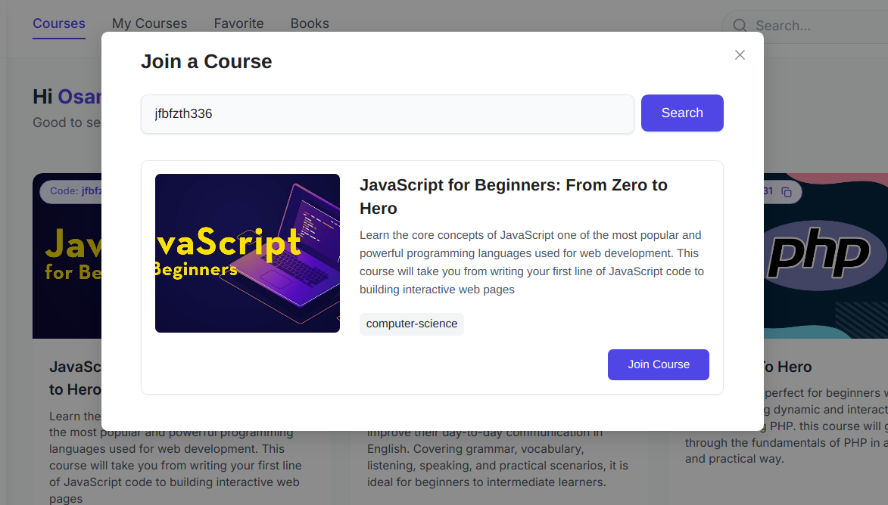

# wessAcademy 📘🚀  
A modern microservice-based online education platform for managing courses, student progress, AI-enhanced learning tools, and admin analytics.

## 🛠️ Tech Stack

### 🔧 Microservices
- **Server 1**: FastAPI, PostgreSQL, SQLAlchemy, JWT
- **Server 2**: Spring Boot, MongoDB, Redis

### 💻 Frontends
- **Client**: Next.js, Ant Design, Zustand, TanStack Query
- **Admin Panel**: Angular, PrimeNG

## 📚 Core Features

### ✅ Authentication System
- JWT-secured user signup/login
- User settings and profile management

### 🎓 Course Management
- Courses organized by **majors** and **sections**
- Enroll in courses with a **join code** if out of major
- Each course tracks progress with a progress bar  

### 📝 Notes for Each Course
- Users can add personal notes per course  

### 🧠 AI Chatbot (Per Course)
- Integrated AI chatbot trained on course content and sections
- Helps students understand materials interactively  

### 🧪 AI-Generated Quiz (Last Course)
- Quizzes generated dynamically using AI
- Questions update on each access  

### 📚 Book Recommendations by Major
- Books scraped from online sources based on major
- Summarized using AI for quick review  

### 📥 Join Course with Code
- Students can join out-of-major courses using a course code  

## 💾 Server 2 (Spring Boot)
### ⭐ Favorite Course Management
- Allows users to mark and manage favorite courses
- Data stored in MongoDB and cached with Redis  

## 🧑‍💼 Admin Panel (Angular + PrimeNG)

### 📈 Site Analytics
- Dashboard for students, majors, and course statistics  

### 🧑‍🏫 Manage Courses
- Add/Edit/Delete courses and sections
- Built-in section editor  

### 👥 Manage Users
- Manage users  

## 📡 API Endpoints

### 🔐 Auth (FastAPI)

| Method | Endpoint                | Description             |
|--------|-------------------------|-------------------------|
| POST   | /api/auth/signup        | Register a new user     |
| POST   | /api/auth/signin        | Login user              |
| GET    | /api/auth/userData      | Get user data           |
| PUT    | /api/auth/updateUser    | Update user information |

---

### 📚 Course (FastAPI)

| Method | Endpoint                                | Description                           |
|--------|-----------------------------------------|---------------------------------------|
| GET    | /api/course/coursesList                 | Get list of all courses               |
| POST   | /api/course/enrollCourse                | Enroll in a course                    |
| GET    | /api/course/courseDetails               | Get course details                    |
| PUT    | /api/course/updateCourseProgress        | Update course progress                |
| POST   | /api/course/addNote                     | Add a personal note                   |
| GET    | /api/course/getNotes                    | Get all personal notes                |
| DELETE | /api/course/deleteNote                  | Delete a note                         |
| POST   | /api/course/askAI                       | Ask course-specific AI chatbot        |
| POST   | /api/course/generateFinalTest           | Generate an AI-based final test       |
| POST   | /api/course/finishCourse                | Mark course as completed              |
| POST   | /api/course/getCourseByCode             | Retrieve course using a join code     |
| POST   | /api/course/joinCoursePerCode           | Join a course by code (cross-major)   |

---

### 📊 Dashboard (FastAPI)

| Method | Endpoint                                          | Description                          |
|--------|---------------------------------------------------|--------------------------------------|
| GET    | /api/dashboard/get_total                          | Get total stats                      |
| GET    | /api/dashboard/get_major_statistics               | Get major statistics                 |
| GET    | /api/dashboard/get_course_enrollment              | Get course enrollment stats          |
| GET    | /api/dashboard/get_majors                         | Get list of majors                   |
| GET    | /api/dashboard/get_all_courses                    | Get all courses                      |
| DELETE | /api/dashboard/delete_course/{course_id}          | Delete a course                      |
| POST   | /api/dashboard/add_course                         | Add a new course                     |
| GET    | /api/dashboard/courseDetails/{course_id}          | Get details of a specific course     |
| GET    | /api/dashboard/get_users                          | Get list of users                    |
| PUT    | /api/dashboard/block_user/{user_id}               | Block a user                         |
| PUT    | /api/dashboard/unblock_user/{user_id}             | Unblock a user                       |

---

### 📖 Book (FastAPI)

| Method | Endpoint                                | Description                  |
|--------|-----------------------------------------|------------------------------|
| GET    | /api/book/get_major_books/{major}       | Get book recommendations     |
| POST   | /api/book/book_summary                  | Book Summary with AI         |

### ❤️ Favorite (Spring Boot)

| Method | Endpoint                         | Description                          |
|--------|----------------------------------|--------------------------------------|
| GET    | /api/favorite                    | Get all favorites                    |
| POST   | /api/favorite                    | Add a new favorite                   |
| DELETE | /api/favorite/{id}               | Delete favorite by ID                |
| GET    | /api/favorite/check              | Check if a course is favorited       |
| GET    | /api/favorite/getByUser          | Get favorites by user ID             |